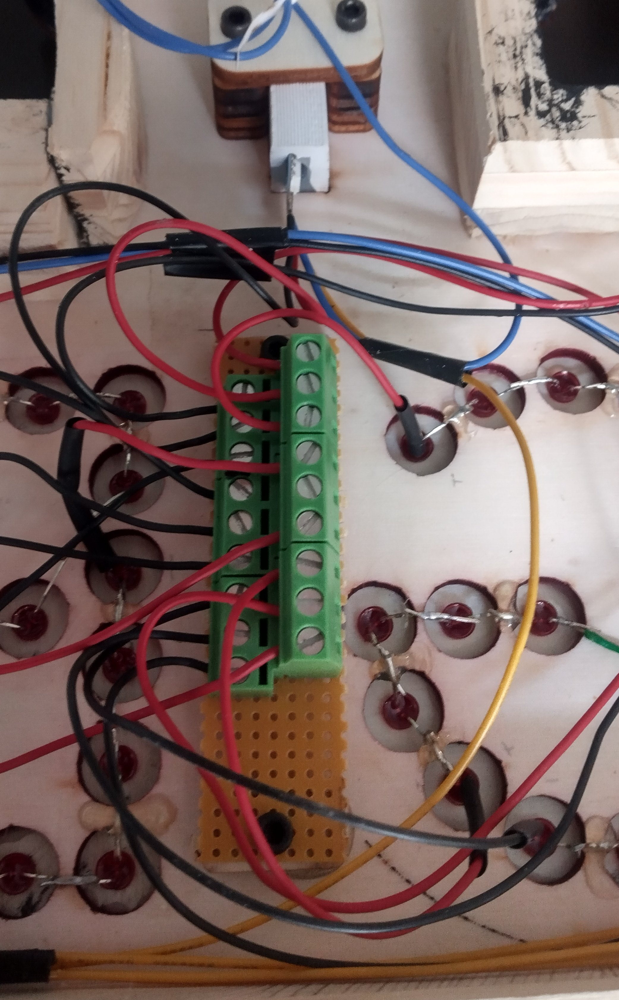
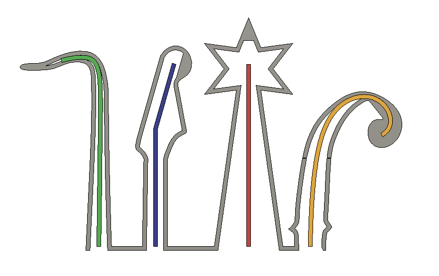

# Introduction
*Applaudimètre* is a project in collaboration withe the music band [Lady Bee and The Epileptics](https://www.ladybeeandtheepileptics.com). 

The goal in to create an applause meter for the project *Sondage* with a remote controle fixed on the saxophone.

# Bill of material
## Transmitter (remote control)
* [Pro micro ATMEGA32U4 Module 5V](https://www.aliexpress.com/item/32840365436.html?spm=a2g0o.order_list.order_list_main.59.37cc1802Q5Wayy&gatewayAdapt=glo2deu)
* [1800mAh Lithium Polymer LiPo Battery](https://www.aliexpress.com/i/4000342686226.html)
* [Sparkfun LiPo charger/booster - PRT-14411](https://www.digikey.ch/en/products/detail/sparkfun-electronics/PRT-14411/7725301?s=N4IgTCBcDaIAoCUAqBaAjAFg2tIC6AvkA)
* [433Mhz RF Wireless Transmitter Module](https://www.aliexpress.com/item/1970487479.html?spm=a2g0o.productlist.0.0.17e7201ewHPG8p&algo_pvid=c0aa7e47-bb9f-4eea-923a-5b1128d951d6&algo_exp_id=c0aa7e47-bb9f-4eea-923a-5b1128d951d6-0&pdp_ext_f=%7B%22sku_id%22%3A%2210000000101355831%22%7D&pdp_npi=2%40dis%21CHF%210.74%210.72%21%21%211.14%21%21%402101d8f416608526529607693e15eb%2110000000101355831%21sea&curPageLogUid=ryhQ8y89I6hc)
* [433Mhz Antenna Copper Spring](https://www.aliexpress.com/item/4000960125591.html?spm=a2g0o.order_list.order_list_main.137.37cc1802Q5Wayy)
* [0.91 inch OLED Module White OLED 128X32](https://www.aliexpress.com/item/32777216785.html)
* [10 MΩ Linear Taper Rotary Potentiometer Resistor](https://www.aliexpress.com/item/1005002891439915.html?spm=a2g0o.productlist.0.0.43aa3edeVXm6RS&algo_pvid=be441ad0-8c39-4bd4-a157-3e0841512e20&algo_exp_id=be441ad0-8c39-4bd4-a157-3e0841512e20-0&pdp_ext_f=%7B%22sku_id%22%3A%2212000022648285531%22%7D&pdp_npi=2%40dis%21CHF%211.51%211.33%21%21%211.16%21%21%402101e9d116607453782565165e8d37%2112000022648285531%21sea&curPageLogUid=jjp8vKxFA57H)
* [10 KΩ Linear Log Slide Pot](https://www.aliexpress.com/item/1005001448365017.html?spm=a2g0o.productlist.main.3.1e8c828bfn3sNs&algo_pvid=2d20dbbf-d833-495a-b663-8edac31cfd59&algo_exp_id=2d20dbbf-d833-495a-b663-8edac31cfd59-1&pdp_npi=4%40dis%21CHF%211.03%210.82%21%21%211.15%21%21%40210324bf16935083727388414e7c3a%2112000016156453615%21sea%21CH%210%21A&curPageLogUid=UncgP9kgLdvD)
* 3x Momentary switch
* 1x Slide switch
* 10K resistance

## Receiver
* [LED stripe WS2815, White PCB, 3m 60 IP30](https://www.aliexpress.com/item/4001322411818.html?spm=a2g0o.order_list.order_list_main.84.37cc1802Q5Wayy)
* [Neon Tube for LED Strip](https://www.aliexpress.com/item/4000095850068.html?spm=a2g0o.detail.1000060.2.62f649d9u4zcRW&gps-id=pcDetailBottomMoreThisSeller&scm=1007.13339.300834.0&scm_id=1007.13339.300834.0&scm-url=1007.13339.300834.0&pvid=57940bc1-1b11-424b-840e-7d97b07bb0e9&_t=gps-id%3ApcDetailBottomMoreThisSeller%2Cscm-url%3A1007.13339.300834.0%2Cpvid%3A57940bc1-1b11-424b-840e-7d97b07bb0e9%2Ctpp_buckets%3A668%232846%238112%231997&pdp_ext_f=%7B%22sku_id%22%3A%2212000015942927508%22%2C%22sceneId%22%3A%223339%22%7D&pdp_npi=2%40dis%21CHF%2110.56%212.55%21%21%21%21%21%402101f6b216608516541226328e6cd3%2112000015942927508%21rec&gatewayAdapt=glo2fra)
* [LM2596s DC-DC Step-down Power Supply Module](https://www.aliexpress.com/item/1005003623537411.html?spm=a2g0o.productlist.0.0.195e196f3xUBMo&algo_pvid=d6723288-a6a4-4bfa-87e9-7c3f856d4b2c&algo_exp_id=d6723288-a6a4-4bfa-87e9-7c3f856d4b2c-0&pdp_ext_f=%7B%22sku_id%22%3A%2212000026542655159%22%7D&pdp_npi=2%40dis%21CHF%214.59%212.16%21%21%21%21%21%402103143616607665410162150ebfbb%2112000026542655159%21sea&curPageLogUid=sQC0YxDRH4Xw)
* [433Mhz RF Wireless Transmitter Module](https://www.aliexpress.com/item/1970487479.html?spm=a2g0o.productlist.0.0.17e7201ewHPG8p&algo_pvid=c0aa7e47-bb9f-4eea-923a-5b1128d951d6&algo_exp_id=c0aa7e47-bb9f-4eea-923a-5b1128d951d6-0&pdp_ext_f=%7B%22sku_id%22%3A%2210000000101355831%22%7D&pdp_npi=2%40dis%21CHF%210.74%210.72%21%21%211.14%21%21%402101d8f416608526529607693e15eb%2110000000101355831%21sea&curPageLogUid=ryhQ8y89I6hc)
* [10 MΩ Linear Taper Rotary Potentiometer Resistor](https://www.aliexpress.com/item/1005002891439915.html?spm=a2g0o.productlist.0.0.43aa3edeVXm6RS&algo_pvid=be441ad0-8c39-4bd4-a157-3e0841512e20&algo_exp_id=be441ad0-8c39-4bd4-a157-3e0841512e20-0&pdp_ext_f=%7B%22sku_id%22%3A%2212000022648285531%22%7D&pdp_npi=2%40dis%21CHF%211.51%211.33%21%21%211.16%21%21%402101e9d116607453782565165e8d37%2112000022648285531%21sea&curPageLogUid=jjp8vKxFA57H)
* [Sparkfun Sound Detector - SEN-12642](https://www.digikey.ch/en/products/detail/sparkfun-electronics/SEN-12642/5762440)
* [Red LED Diode F5](https://www.aliexpress.com/item/1005003483614644.html?spm=a2g0o.order_list.order_list_main.69.37cc1802Q5Wayy)
* [Micro Type USB USB 2.0 Male Connector to Micro Type 2.0 Female Extension](https://www.aliexpress.com/item/1005004622194467.html?spm=a2g0o.order_list.order_list_main.64.37cc1802Q5Wayy)
* [Tchauxduino - custom leonardo ATMEGA32U4 arduino module](https://gitlab.com/bbonnal/tchauduino)
* MOSFET
* Power Switch
* 27 mm wood
* 4 mm Plywood
* 2 mm Plywood for panel interface

# Electrical
## Transmitter
Here is the fritzing diagram and images of the protoboards:

  
  
  

## Receiver
Here is the fritzing diagram and images of the protoboards:

  
  
  

The goal was to use a maximum of scew driver terminal to easy fix and disassemble the reveiver.

# Mecanical
## Transmitter
The goal of the mechanical part is to fix the transmitter on the saxophone as a remote control. Custom 3D print is used to perform this: 

  
  
  

## Receiver
The goal is to create an applause meter and integrate all the electronics to reveive the signal from the tranmitter and drive the LEDs.

Fusion 360 was use to design the receiver mechanically

  
  
  

All woods was processed with a laser cutter (Rayjet R500) except the 27mm spacer (gray part of the center image) with the CNC. For pannels, 2mm woods is used.

# Software
The arduino code can be founded in `software` folder.
In order to create the table, the csv file is edited, and the with the python script `csv-to-h.py`, two `.h` files are created as input for the arduino sketch like:

